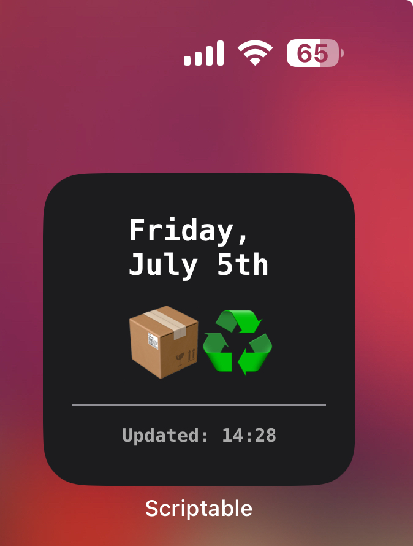

# Bromley Bins

Designed for use as a small widget, showing the next collection date and which bins are due for collection, given a valid Bromley "bin ID".

## Installation

1. Install the [Scriptable app](https://itunes.apple.com/us/app/scriptable/id1405459188?mt=12).
2. In Scriptable, create a new script.
3. Copy the code from [BromleyBins.js](BromleyBins.js) into the script editor, and save the script.
4. Edit the `BIN_ID` variable in the script to match your Bromley bin ID (see below for instructions).
5. Create a new large Scriptable widget on your home screen, and select the Football Scores script.

## Accompanying app

If you find this widget useful, you can also get the free [Bromley Bins app](https://apps.apple.com/gb/app/bromley-bins/id6504371978) from the App Store.

## How to get your Bromley bin ID

1. Enter your postcode and select your address at the [Bromley Waste & Recycling Services website](https://recyclingservices.bromley.gov.uk/waste/).
2. Grab the number at the very end of the website address that loads, which should look like this: `https://recyclingservices.bromley.gov.uk/waste/bin/3642936`.
3. Enter the number (e.g. `3642936`) as your BIN_ID in the script.

## Screenshot

