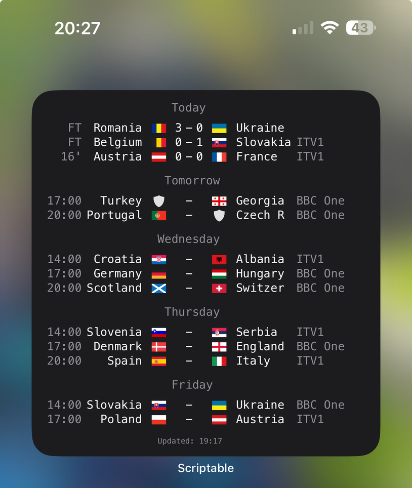

# Football Scores

Designed for use as a large widget, showing football scores and upcoming fixtures for the UK and major international competitions, including TV channel information.

## Installation

1. Install the [Scriptable app](https://itunes.apple.com/us/app/scriptable/id1405459188?mt=12).
2. In Scriptable, create a new script.
3. Copy the code from [FootballScores.js](FootballScores.js) into the script editor, and save the script.
4. Create a new large Scriptable widget on your home screen, and select the Football Scores script.

## Screenshot

