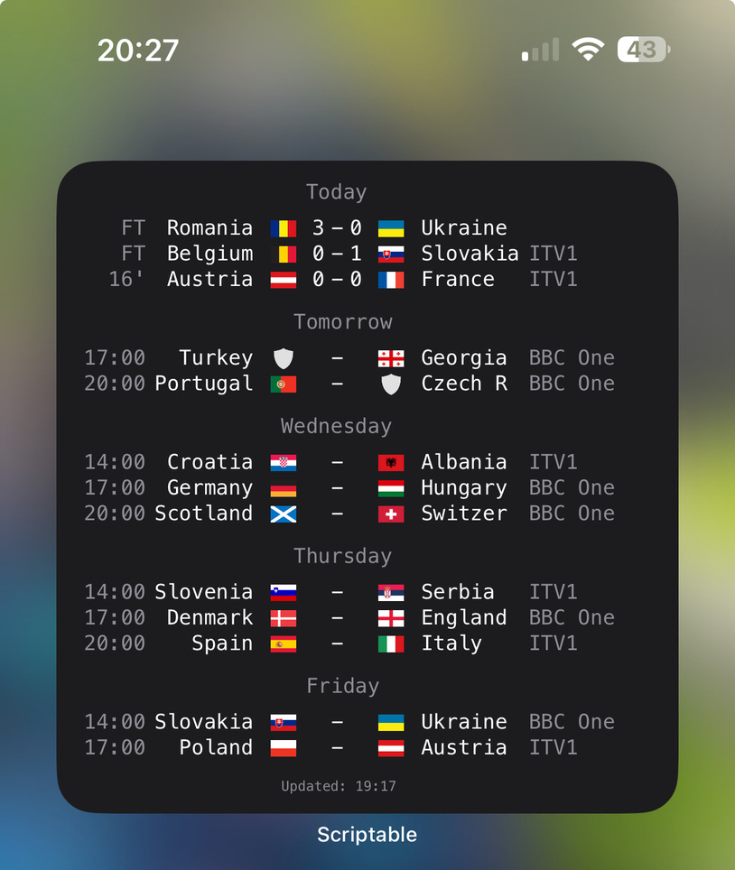

# Top Scores

Home screen widget for the upcoming *Top Scores* app, showing football scores and upcoming fixtures for competitions/teams of your choosing.

## Automatic installation

1. Install the [Scriptable app](https://itunes.apple.com/us/app/scriptable/id1405459188?mt=12).
2. Download the *Top Scores* from the App Store (coming soon).
3. Go into the *Settings* screen, scroll down to the *Widget* section, and tap the download button.

## Manual installation

1. Install the [Scriptable app](https://itunes.apple.com/us/app/scriptable/id1405459188?mt=12).
2. In Scriptable, create a new script.
3. Copy the code from [FootballScores.js](FootballScores.js) into the script editor, and save the script.
4. Replace the placeholder `{DEVICE_ID}` with your device ID, which you can find in the *Settings* screen of the *Top Scores* app.
5. Create a new large Scriptable widget on your home screen, and select the Football Scores script.

## Screenshot

