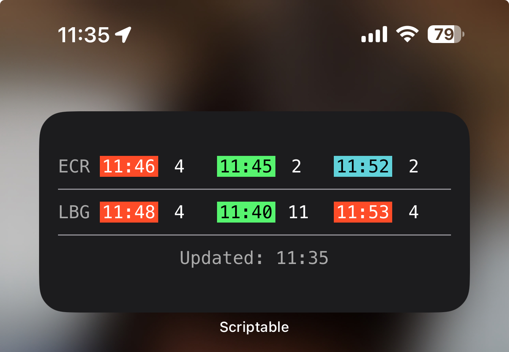

# TrainTrack

Designed for use as a medium widget, showing upcoming trains for stations of your choosing in the UK.

## Installation

1. Install the [Scriptable app](https://itunes.apple.com/us/app/scriptable/id1405459188?mt=12).
2. In Scriptable, create a new script.
3. Copy the code from [TrainTrack.js](TrainTrack.js) into the script editor, and save the script.
4. Set the from and to stations (```FROM_STATION``` and ```TO_STATION```) in the script to the stations you want to use. 
5. Create a new medium Scriptable widget on your home screen, and select the TrainTrack script.

## Accompanying app

If you find this widget useful, you can also get the free [TrainTrack UK app](https://apps.apple.com/us/app/traintrack-uk/id6504205950) from the App Store.

## Screenshot

