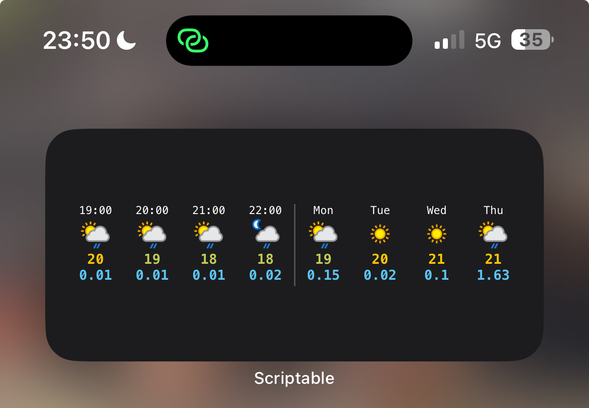

# Football Scores

Designed for use as a medium widget, showing the weather forecast for the next few hours / days:

* Conditions
* Temperature
* Precipitation (in mm)

## Installation

1. Get a free API key from https://www.weatherapi.com, and set it as the `WEATHER_API_KEY` variable in the script.
2. Install the [Scriptable app](https://itunes.apple.com/us/app/scriptable/id1405459188?mt=12).
3. In Scriptable, create a new script.
4. Copy the code from [WeatherForecast.js](WeatherForecast.js) into the script editor, and save the script.
5. Create a new medium Scriptable widget on your home screen, and select the WeatherForecast script.

## Screenshot

